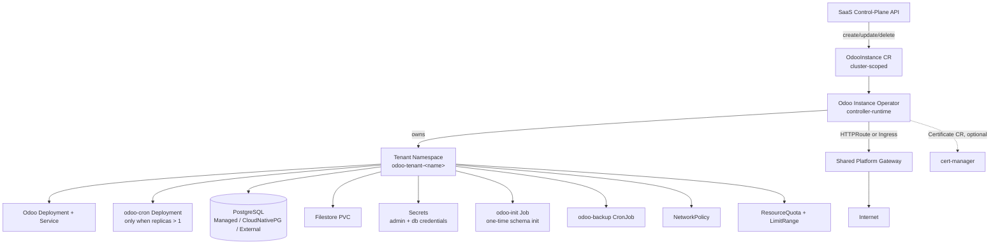
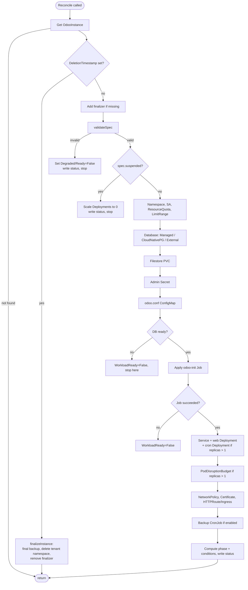
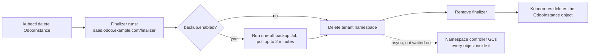
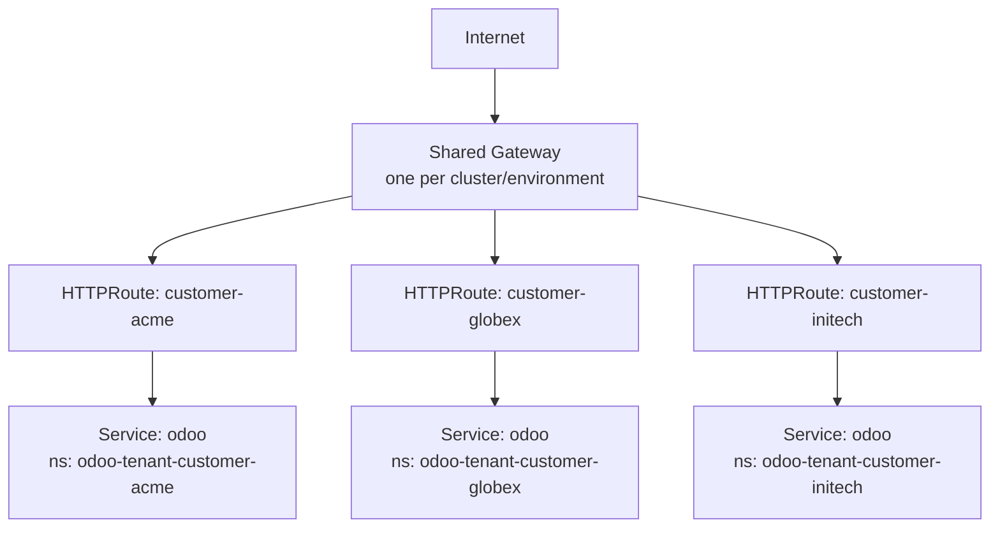
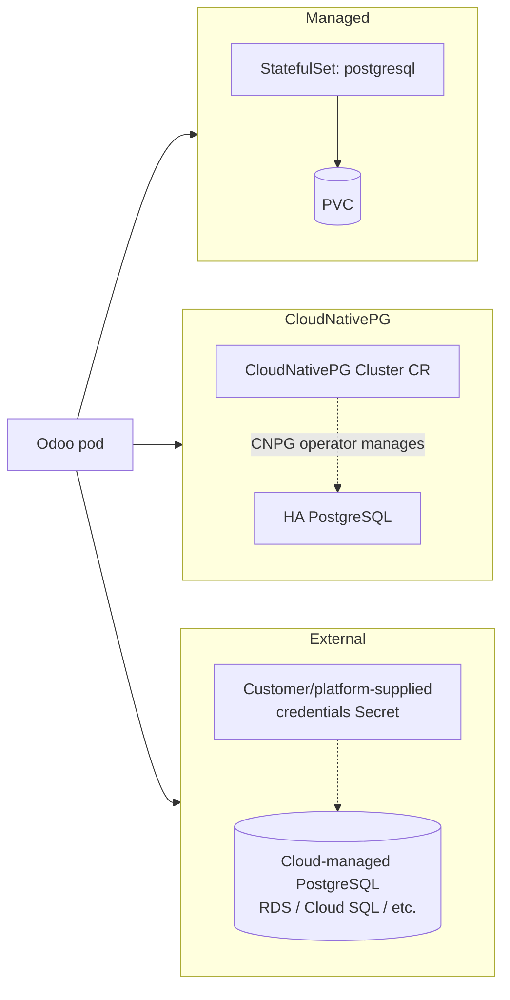
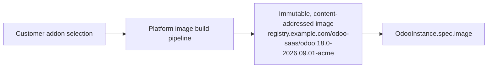
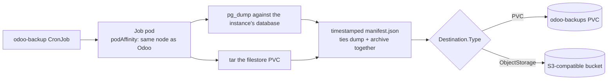

# الهندسة المعمارية (Architecture)

يشرح هذا المستند كيفية بناء منصة Odoo SaaS، والمفاضلات (trade-offs) وراء
قراراتها التصميمية الكبرى، وكيف يُتوقع أن تتكامل واجهة برمجة تطبيقات
(API) مستوى تحكم الـ SaaS معها. كل ما ورد هنا تم التحقق منه على عنقود
Kubernetes حقيقي (microk8s، مع تثبيت Gateway API وTraefik) أثناء بناء هذا
المستودع، وليس مجرد تجميع (compile) — راجع "القيود المعروفة" للاطلاع على
الأمور القليلة التي لم يتسنَّ اختبارها بهذه الطريقة.

## 1. الهندسة المعمارية العامة



العقد الكامل لواجهة الـ SaaS مع Kubernetes هو المورد المخصص
`OdooInstance`: فهي تُنشئ وتقرأ وتحدّث وتحذف ذلك الكائن الواحد فقط، ولا
تلمس أبدًا Deployment أو Service أو PVC أو Secret أو Job بشكل مباشر.
المشغّل (operator) — وهو وحدة تحكم (controller) واحدة من نوع
`controller-runtime` — هو الشيء الوحيد الذي يتحدث مع أنواع الموارد
الفرعية (child resource kinds) تلك.

## 2. مسؤوليات المكوّنات

| المكوّن | المسؤولية |
|---|---|
| `api/v1alpha1` | نوع CRD الخاص بـ `OdooInstance`: spec، status، علامات (markers) التحقق والقيم الافتراضية. المخطط (schema) الوحيد الذي يحتاج الطرفان — واجهة SaaS وKubernetes — إلى الاتفاق عليه. |
| `internal/resources` | دوال خالصة (pure functions): `(instance) -> desired Kubernetes object`. بلا أي استدعاءات API. قابلة للاختبار بالكامل عبر اختبارات الوحدة دون الحاجة إلى عنقود. |
| `internal/controller` | حلقة التوفيق (reconciliation loop): تجلب الحالة الحية، تستدعي دوال البناء في `internal/resources`، تطبّق النتيجة عبر Server-Side Apply، وتحسب الحالة/الشروط (status/conditions). |
| `cmd/main.go` | يربط المُوفّق (reconciler) بمدير `controller-runtime`: تسجيل المخطط (scheme)، انتخاب القائد (leader election)، خوادم المقاييس/الصحة (metrics/health)، أعلام سطر الأوامر لضبط إعدادات المنصة الشاملة. |
| `charts/odoo-operator` | يثبّت المشغّل نفسه (CRD + RBAC + Deployment). هذا ما يشغّله مشغّل المنصة مرة واحدة لكل عنقود. |
| `charts/odoo-instance` | اختياري: غلاف GitOps يُنشئ `OdooInstance` واحد لكل إصدار (release) Helm، للمنصات التي توفّر المستأجرين عبر Argo CD/Flux بدلاً من استدعاءات API مباشرة. |

## 3. تصميم CRD

```yaml
apiVersion: saas.odoo.example.com/v1alpha1
kind: OdooInstance
metadata:
  name: customer-acme        # ذو نطاق عنقودي (cluster-scoped)؛ راجع "نموذج تعدد المستأجرين"
spec:
  version: "18.0"
  image: {repository, tag, pullPolicy, pullSecretRefs}
  domain: {hostname, tls: {enabled, secretName, issuerRef}}
  database: {mode: Managed|CloudNativePG|External, version, storage, credentialsSecretRef}
  storage: {filestore: {size, storageClassName, accessMode}}
  resources: {requests, limits}                # إلزامي (required)
  addons: [{name}]                              # معلوماتي فقط
  workers: {count, maxCronThreads}
  replicas: 1
  autoscaling: {enabled}                         # محجوز، غير مُنفَّذ بعد
  backup: {enabled, schedule, retention, destination}
  networking: {networkPolicy: {enabled}, routeAnnotations}
  tenancy: {namespaceOverride, resourceQuota}
  suspended: false
status:
  observedGeneration: 1
  phase: Pending|Provisioning|Ready|Updating|Degraded|Failed|Suspended|Deleting
  conditions: [{type, status, reason, message, lastTransitionTime, observedGeneration}]
  url: https://customer-acme.example.com
  tenantNamespace: odoo-tenant-customer-acme
  adminCredentialsSecretName: odoo-admin-credentials
  databaseCredentialsSecretName: odoo-database-credentials
  observedImage: registry.example.com/odoo-saas/odoo:18.0-abc123
  replicas: 1
  readyReplicas: 1
  lastBackupTime: "2026-09-13T02:00:00Z"
  lastBackupStatus: Succeeded
```

التوثيق الكامل للحقول موجود كتعليقات توثيق (doc comments) في Go داخل
`api/v1alpha1/odooinstance_types.go` — هذا الملف، وليس هذا المستند، هو
المرجع الأساسي (source of truth) للمخطط (`make manifests` يعيد توليد YAML
الخاص بـ CRD منه). تستحق بعض القرارات التصميمية الإشارة إليها هنا:

- **`resources` إلزامي، بلا قيم افتراضية.** كل عنصر Kubernetes أساسي آخر
  مبني عليه (العمّال (workers)، التكرارات (replicas)، أحجام PVC) لا معنى
  له دون معرفة ميزانية الحوسبة؛ فرض هذا مسبقًا يجعل تخطيط سعة المستأجر
  صريحًا بدلاً من أن يكون عرضيًا.
- **`addons` بيانات وصفية (metadata)، وليست تعليمات تشغيلية.** راجع
  القسم 9.
- **`image.tag` يرفض الوسوم (tags) القابلة للتغيير** (`latest`, `main`, ...)
  ما لم يتم تشغيل المشغّل بخيار `--allow-mutable-tags` (للتطوير فقط).
  راجع القسم 9 مرة أخرى.
- **المتطلبات الشرطية (مثل `backup.schedule` فقط عند تفعيل
  `backup.enabled`) يتم التحقق منها في Go
  (`internal/controller/validate.go`)، وليس كحقل `required` في مخطط
  CRD.** أخطأت مسودة سابقة في هذا — بجعل `schedule` إلزاميًا بشكل غير
  مشروط في مخطط CRD، مما رفض كل نسخة (instance) لم تُفعّل النسخ
  الاحتياطي على الإطلاق. الاختبار الحي مقابل apiserver حقيقي اكتشف هذا
  خلال دقائق؛ مراجعة المخطط وحدها لم تكن لتكتشفه.

### مأزق دقيق في القيم الافتراضية لـ CRD (يستحق فهمه قبل توسيع هذه الـ API)

بعض الحقول — `domain.tls.enabled`، `networking.networkPolicy.enabled`،
`workers.count`، `workers.maxCronThreads` — لها قيمة افتراضية **غير
صفرية** في CRD (`true`، `true`، `2`، `1`) وقد تم تعريفها عمدًا **بدون**
`json:"...,omitempty"`. يبدو هذا معكوسًا للوهلة الأولى، لذا إليك السبب،
الذي اكتُشف من خلال مصادفة الخلل حيًا:

مكتبة `encoding/json` في Go تحترم `omitempty` فقط عبر فحص *القيمة
الصفرية* لنوع Go لكل حقل (`false`، `0`، `""`، nil) — وهي لا تعرف شيئًا
عن وجود قيمة افتراضية لـ CRD. لو كان لحقل `TLSSpec.Enabled` خاصية
`omitempty`، فإن أي عميل Go (بما فيه وحدة التحكم هذه) يجلب الكائن،
ويترك `Enabled: false` في الذاكرة، ثم يعيد تسلسل (re-marshal) البنية
(struct) بالكامل من أجل `Update()`، سيقوم بصمت **بحذف** مفتاح `enabled`
من الطلب (لأن `false` تبدو "فارغة" (empty) بالنسبة لمُرمِّز JSON) — وعندها
سيعيد خادم الـ API تطبيق القيمة الافتراضية `default: true` للمخطط، مما
يقلب رغبة العميل الصريحة بـ "بدون TLS" إلى "TLS مُفعّل" دون أن يغيّر أحد
الـ spec. تم استنساخ هذا بالضبط بهذه الطريقة على عنقود حي أثناء بناء هذا
المشغّل.

هناك إصلاحان مستقلان معمول بهما:

1. هذه الحقول المحددة لم تعد تستخدم `omitempty`، لذا تُرسَل قيمتها
   الصفرية في Go دائمًا بشكل صريح ولا يمكن أبدًا إعادة تطبيق القيمة
   الافتراضية عليها لاحقًا.
2. الكتابة الوحيدة التي تُعدّل الـ spec من قِبل وحدة التحكم نفسها (إضافة/
   إزالة الـ finalizer) تستخدم الآن `client.Patch` مع `client.MergeFrom`،
   وليس `Update` لكامل الكائن — لذا فهي ترسل فقط فرقًا (diff) لحقل
   `metadata.finalizers`، ولا تعيد تسلسل الـ `spec` إطلاقًا.

النتيجة الطبيعية: **عميل Go يبني بيانًا حرفيًا (literal) جزئيًا من نوع
`OdooInstanceSpec` يحصل على القيمة الصفرية في Go لهذه الحقول، وليس القيمة
الافتراضية لـ CRD**، ما لم يُحدد خلاف ذلك. يوفّر
`api/v1alpha1/defaults.go` دالة `DefaultOdooInstanceSpec()` لهذا السبب
بالضبط — ابدأ منها وتجاوز (override) ما تحتاجه، بدلاً من الاعتماد على
التقييم الافتراضي من جانب الخادم انطلاقًا من بنية Go مُصنَّفة (typed).

## 4. تدفق التوفيق (Reconciliation flow)



كل خطوة هي عملية خالصة من نوع "احسب الكائن المرغوب، طبّقه عبر
Server-Side Apply" (راجع القسم 11، القدرة على الإعادة (Idempotency)) — لا
يوجد فرع من نوع `if firstTime { create }` في أي مكان في هذه الشيفرة.

### لماذا يُحجب Deployment الخاص بالويب خلف Job لتهيئة قاعدة البيانات

لن يخدم Odoo أي طلب HTTP واحد مقابل قاعدة بيانات بلا مخطط (schema) — كل
طلب يفشل بخطأ 500 برسالة `KeyError: 'ir.http'` لأن سجل النماذج (model
registry) ليس لديه ما يُحمّله. هذا ليس افتراضيًا: هذا بالضبط ما حدث في
أول مرة تم فيها إنشاء Deployment الويب الخاص بهذا المشغّل مباشرة بعد أن
أصبحت قاعدة البيانات قابلة للوصول، قبل أن يُنفَّذ `odoo -i base` عليها.
الإصلاح هو `resources.OdooInitJob` / `internal/controller/init_job.go`:
Job لمرة واحدة يُشغّل `-i base --stop-after-init`، ولا يتم إنشاء
Deployment الويب (والـ cron) إلا بمجرد أن يصبح `status.succeeded > 0`
لهذا الـ Job. لا تزال وحدة التحكم تتعامل مع هذا كتوفيق قابل للإعادة
(idempotent) — "هل يوجد هذا الـ Job وهل نجح" — رغم أن الإجراء الذي يقوم
به الـ Job هو في الواقع عملية لمرة واحدة وغير قابلة للتكرار من منظور
Odoo نفسه.

### حالة جمود (deadlock) في البوابة (gating) يتجنبها هذا التصميم

كانت نسخة سابقة من هذه البوابة تتطلب أيضًا `StorageReady` (ربط PVC الخاص
بمخزن الملفات) قبل إنشاء Job التهيئة. على عنقود يستخدم صنف تخزين
(StorageClass) افتراضي بوضع `VolumeBindingMode: WaitForFirstConsumer` —
وهو حال معظم أصناف التخزين في الإنتاج (EBS/PD/local-path، وكذلك عنقود
اختبار microk8s-hostpath الخاص بهذه المنصة) — لا يُربط الـ PVC أبدًا حتى
يشير إليه أي pod فعلي ويتم جدولته. اشتراط "الربط (bound)" قبل إنشاء أول
pod يمكن أن يُطلق هذا الربط هو حالة جمود، وقد تكررت فورًا أثناء الاختبار.
الإصلاح: يتطلب Job التهيئة (وكل مستهلك آخر لـ PVC) فقط أن يكون الـ PVC
**موجودًا**، وليس **مربوطًا (Bound)** بالفعل.

## 5. ملكية الموارد وحذفها

يحمل كل مورد فرعي ذو نطاق مساحة اسم (namespaced) مراجع ملكية
(`ownerReferences`) تشير إلى `OdooInstance` (مرجع صالح رغم أن المالك ذو
نطاق عنقودي — يسمح Kubernetes بأن يكون كائن ذو نطاق مساحة اسم مملوكًا
لكائن ذي نطاق عنقودي، وليس العكس). هذه آلية إضافية للمراقبة
(observability) وجمع القمامة (GC)، وليست آلية الحذف الأساسية:



**قيد معروف ومتعمَّد:** حذف مساحة اسم المستأجر يحذف أيضًا كائنات PVC
الخاصة به — مخزن الملفات، قاعدة البيانات، وأي نسخ احتياطية مخزّنة
محليًا. لا توجد بدائية (primitive) من نوع "احذف كل شيء ما عدا هذه
الأحجام (volumes)" بمجرد تفكيك مساحة الاسم المالكة. لذا يعتمد الاحتفاظ
الفعلي بالبيانات بعد حذف المستأجر على وصول النسخة الاحتياطية الأخيرة إلى
`spec.backup.destination` **قبل** حذف مساحة الاسم، وهذا بالضبط سبب كون
وجهة `ObjectStorage` (خارج مساحة اسم المستأجر) هي الخيار المُوصى به لأي
مستأجر يجب أن تنجو بياناته من الحذف — وجهة PVC لا تنجو منه.

## 6. نموذج تعدد المستأجرين (السؤال 3)

**القرار: `OdooInstance` ذو نطاق عنقودي، وتقوم وحدة التحكم باستنتاج
وإنشاء مساحة اسم مخصصة `odoo-tenant-<name>` لكل نسخة (instance).**

البدائل التي تم النظر فيها:

| الخيار | المفاضلة (Trade-off) |
|---|---|
| CRD ذو نطاق مساحة اسم، وواجهة SaaS تُنشئ مساحات الاسم مسبقًا | استدعاءان لواجهة API بدلاً من واحد؛ ستحتاج واجهة SaaS إلى منطق دورة حياة مساحة اسم خاص بها (التسمية، RBAC، الحصص) يكرر ما يحتاجه المشغّل داخليًا أصلًا لتعدد المستأجرين على أي حال. |
| CRD ذو نطاق مساحة اسم، مساحة اسم مشتركة بين المستأجرين | مرفوض كليًا: لا توجد حدود عزل NetworkPolicy/RBAC/ResourceQuota بين العملاء الذين يشاركون مساحة اسم واحدة؛ مستأجر مخترق أو مزعج (noisy-neighbor) يؤثر مباشرة على الآخرين. |
| **CRD ذو نطاق عنقودي، والمشغّل يملك مساحة اسم لكل مستأجر (المُختار)** | استدعاء API واحد يوفّر عزلًا كاملًا. التكلفة: يحتاج المشغّل إلى صلاحيات RBAC لإنشاء/حذف `namespaces` (ذات نطاق عنقودي)، وهي صلاحية أكبر مما سيحتاجه تصميم CRD ذو نطاق مساحة اسم — يُخفَّف هذا بأن بقية صلاحيات RBAC الخاصة به ضئيلة (راجع القسم 10). |

مساحة اسم لكل مستأجر توفّر:

- حدود **NetworkPolicy** (القسم 7) يستحيل تجاوزها بسبب سوء تحديد نطاق
  مُحدِّد (selector)، إذ لا يوجد شيء آخر في مساحة الاسم لتحديده.
- **ResourceQuota/LimitRange** (`internal/resources/tenancy.go`) يحد من
  إجمالي الاستهلاك بغض النظر عمّا يطلبه `OdooInstance` واحد.
- سرد حذف يتمثل بحذف مساحة اسم واحدة، وليس N من عمليات الحذف الموجَّهة
  فرديًا.
- **تسمية** بسيطة: `odoo-tenant-<اسم النسخة>` (قابلة للتجاوز عبر
  `spec.tenancy.namespaceOverride` لسيناريوهات الترحيل/إعادة التسمية).

## 7. الشبكات (السؤال 4)

**القرار: `HTTPRoute` الخاص بـ Gateway API هو آلية التوجيه الافتراضية
والمفضلة؛ Ingress التقليدي بديل مدعوم بالكامل، يُختار عبر علم (flag) على
مستوى المشغّل بأكمله (`--networking-provider`)، وليس لكل مستأجر على
حدة.**



لماذا Gateway API بدلًا من Ingress/LoadBalancer واحد لكل مستأجر: موازن
تحميل (LoadBalancer) سحابي مخصص لكل عميل لا يتوسع اقتصاديًا أو تشغيليًا
بعد عدد قليل من المستأجرين (راجع القسم 12، التوسع إلى 1000+). بوابة
(Gateway) مشتركة مع `HTTPRoute` واحد لكل مستأجر تتوسع بنفس الطريقة سواء
كان هناك 10 أو 10,000 مستأجر، وهي الاتجاه الذي تتجه نحوه معايرة نظام
شبكات Kubernetes. `OdooInstance.spec.domain.hostname` هو الشيء الوحيد
الذي يحدده المستأجر على الإطلاق؛ نوع مورد التوجيه وهوية البوابة المشتركة
هما من إعدادات المنصة (علم على المشغّل)، وليسا من إعدادات المستأجر — وهذا
أيضًا سبب كونهما أعلامًا `--gateway-namespace`/`--gateway-name`/
`--networking-provider` على `cmd/main.go`، وليسا حقولًا في CRD.

تم التحقق من هذا مقابل تطبيق Traefik لـ Gateway API على عنقود حقيقي: تم
إنشاء كائنات `HTTPRoute`، وقُبلت (`status.parents[].
conditions[type=Accepted]=True`)، وقدّمت حركة مرور حقيقية.

## 8. هندسة قاعدة البيانات (السؤال 1)

**القرار: `spec.database.mode` يكون `Managed` (افتراضي)، أو
`CloudNativePG`، أو `External` — استراتيجية قابلة للتوصيل (pluggable)،
وليست أبدًا PostgreSQL تعمل داخل pod الخاص بـ Odoo نفسه.**



| الوضع | ما الذي يُنشئه المشغّل | متى يُستخدم |
|---|---|---|
| `Managed` (افتراضي) | `StatefulSet` بنسخة واحدة + PVC + Service، جميعها مملوكة لـ `OdooInstance` هذا | افتراضي بلا تبعيات؛ جيد للتبني في مراحله المبكرة والتطوير/الاختبار. لا يوجد HA، ولا PITR. |
| `CloudNativePG` | مورد مخصص `Cluster` من نوع CloudNativePG (عبر العميل الديناميكي/غير المُصنَّف — دون أي اعتماد Go على وحدة CloudNativePG) | الإنتاج: HA حقيقي، تجاوز فشل (failover) آلي، نسخ احتياطي PITR، كل ذلك خلف نفس API الخاصة بـ `OdooInstance` تمامًا. يتطلب تثبيت مشغّل CloudNativePG. |
| `External` | لا شيء — يقرأ المشغّل فقط `Secret` بيانات اعتماد موجودة مسبقًا | PostgreSQL مُدارة سحابيًا (RDS، Cloud SQL، Azure Database)، أو أي قاعدة بيانات تديرها المنصة خارج Kubernetes تمامًا. |

تتقارب الأوضاع الثلاثة جميعها على نفس العقد الداخلي: `Secret` باسم
`odoo-database-credentials` (أو الاسم الذي يوفّره العميل في وضع
External) بمفاتيح `host` و`port` و`dbname` و`username` و`password`.
مُصيِّر إعدادات Odoo نفسه (حاوية init التي تُنتج `odoo.conf`، راجع القسم
13) لا يحتاج أبدًا إلى معرفة أي وضع أنتج ذلك الـ Secret. لذا فإن نقل
مستأجر من `Managed` إلى `CloudNativePG` في الإنتاج هو مشروع ترحيل (تفريغ/
استعادة، ثم تبديل `spec.database.mode`)، وليس إعادة تصميم لواجهة الـ API.

لماذا لا "عنقود PostgreSQL مشترك واحد، قاعدة بيانات واحدة لكل مستأجر"؟ تم
النظر في هذا ورفضه كمسار افتراضي: عنقود مشترك واحد يصبح مخاطرة انتشار
الأضرار (blast-radius) ومخاطرة الجار المزعج (noisy-neighbor) عبر جميع
المستأجرين، و"قاعدة بيانات لكل مستأجر في عنقود مشترك" لا تزال تحتاج إلى
عمل عزل بيانات اعتماد/شبكة لكل مستأجر يحصل عليه مجانًا من عزل مساحة الاسم
في نسخة (`Managed`/`CloudNativePG`) مخصصة. يبقى هذا نمطًا صالحًا لمستأجرين
بمقياس ضخم وموارد منخفضة (راجع القسم 12) ويمكن إضافته لاحقًا كوضع رابع
`DatabaseMode` دون المساس ببقية هذه الـ API.

## 9. استراتيجية الإضافات (addons) والصور

الإضافات (addons) هي أمر يخص **وقت البناء، وليس وقت التشغيل**.
`spec.addons` سجل تصريحي لما يُفترض أن تحتويه صورة المستأجر — يُستخدم
للتحقق/الحالة/التتبع — وليس أبدًا تعليمة لتنزيل أو تثبيت أي شيء داخل pod
قيد التشغيل.



هذا قرار أمني ومتعلق بإمكانية إعادة الإنتاج (reproducibility): تنزيل
إضافات عشوائية عند بدء تشغيل الـ pod مخاطرة في سلسلة التوريد (شيفرة غير
مراجَعة تُنفَّذ ببيانات اعتماد قاعدة بيانات المستأجر) ويكسر إمكانية
التراجع (rollback) (ما الذي كان يعمل بالضبط في الساعة 3 صباحًا عندما
تعطّل؟). كما يرفض `spec.image.tag` الوسوم (tags) الشائعة القابلة للتغيير
(`latest`, `main`, `edge`, ...) افتراضيًا (`--allow-mutable-tags=false`)،
مما يدفع المنصة نحو صورة واحدة غير قابلة للتغيير لكل مجموعة (إصدار،
مجموعة إضافات).

## 10. مراجعة الأمان

- **RBAC**: يمنح `ClusterRole` الخاص بالمشغّل (المُولَّد من علامات
  `+kubebuilder:rbac`، ملف `config/rbac/role.yaml`) بالضبط أنواع الموارد
  التي تُنشئها هذه الشيفرة — لا حروف بدل (wildcards)، لا `cluster-admin`،
  لا وصول إلى Secrets/ConfigMaps/إلخ خارج الأنواع التي يديرها. تم تشغيله
  بحساب خدمة (`ServiceAccount`) خاص به (وليس بـ kubeconfig إداري) مقابل
  عنقود حقيقي ووفّق (reconciled) نسخة إلى `Ready` بلا أي أخطاء
  `forbidden`.
- **أمان الـ Pod**: كل حاوية (Odoo، حاوية init الخاصة بمُصيِّر الإعدادات،
  PostgreSQL، أداة النسخ الاحتياطي) تعمل بـ `runAsNonRoot: true`،
  `allowPrivilegeEscalation: false`، مع إسقاط كل صلاحيات Linux
  (capabilities)، و(لـ Odoo/Postgres) `readOnlyRootFilesystem: true` مع
  كل مسار قابل للكتابة كمجلّد (volume) صريح. تحمل مساحة اسم المستأجر
  نفسها `pod-security.kubernetes.io/enforce: restricted`.
- **مأزق فعلي تم اكتشافه وإصلاحه**: تُعرّف صورة Odoo الرسمية `USER odoo`
  (وهو *اسم*، وليس معرّف مستخدم رقمي (UID)) في ملف Dockerfile الخاص بها.
  لا يمكن لـ Kubernetes التحقق ثابتًا (statically) من أن مستخدمًا مُسمّى
  ليس جذرًا (root)، لذا فإن `runAsNonRoot: true` بدون `runAsUser` رقمي
  صريح جعل الحاوية تفشل في البدء تمامًا (`container has runAsNonRoot and
  image has non-numeric user (odoo), cannot verify user is non-root`)،
  وهو ما تكرر على عنقود حي. الإصلاح هو `runAsUser: 100` /
  `runAsGroup: 101`، جرى التحقق منه بتشغيل `id` داخل الصورة الفعلية
  (`internal/resources/deployment.go`، `odooImageUID`/`odooImageGID`).
  هذه القيمة خاصة بصورة Odoo الرسمية؛ يجب على أي بناء صورة منصة مخصصة إما
  الاحتفاظ بهذا الحساب أو تحديث الثابت (constant) ليطابقه — لا توجد لدى
  Kubernetes طريقة لاكتشافه تلقائيًا عندما يكون `USER` في Dockerfile
  اسمًا.
- **الأسرار (Secrets)**: كلمة مرور المشرف الرئيسية وكلمة مرور قاعدة
  البيانات تُولَّدان مرة واحدة (`internal/resources/secrets.go`، أبجدية
  رقمية فقط، عشوائية تشفيريًا) ولا تُعاد توليدهما أبدًا في التوفيقات
  اللاحقة (`existingOrNewPassword` يُفضّل دائمًا قيمة الـ Secret الحية).
  تصل إلى Odoo فقط عبر متغيرات بيئة `secretKeyRef` في حاوية init، تُستخدم
  فقط لاستبدالها (`sed`) في ملف إعدادات لا تتلقاه حاوية Odoo *الرئيسية*
  أبدًا كمتغيرات بيئة — مما يقلل من مكان تعرّض النص الصريح (plaintext)
  داخل الـ pod. لا تُكتب أي من كلمتي المرور أبدًا في `status` أو الأحداث
  (events) أو السجلات (logs).
- **NetworkPolicy**: رفض افتراضي مع قواعد سماح ضيقة — الدخول (ingress)
  فقط من pods البوابة المشتركة (عبر مساحة الاسم + مُحدِّد الوسم) بالإضافة
  إلى الحركة داخل مساحة الاسم نفسها؛ الخروج (egress) محدود بـ DNS، منفذ
  قاعدة بيانات المستأجر الخاص به، وHTTPS (443) للتكاملات الصادرة. لا
  تشير أي قاعدة أبدًا إلى مساحة اسم مستأجر آخر، لذا فإن الحركة عبر
  المستأجرين مستحيلة بحكم البنية، وليس بضبط السياسات فقط.
- **سلسلة التوريد**: راجع القسم 9 (وسوم صور غير قابلة للتغيير، لا تنزيل
  إضافات وقت التشغيل).

## 11. القدرة على الإعادة (Idempotency) والموثوقية

يُعاد حساب كل مورد فرعي من `OdooInstance.spec` في كل توفيق ويُطبَّق عبر
**Server-Side Apply** (`internal/controller/apply.go`، `client.Apply` +
`client.ForceOwnership`) بدلًا من "Get، قارن، ربما حدّث" مصنوعة يدويًا.
هذا ما يجعل تشغيل حلقة التوفيق مرة واحدة أو ألف مرة يتقارب نحو نفس
الحالة: يُعاد إنشاء/تصحيح أي مورد فرعي محذوف أو منحرف (drifted) ببساطة
في التمرير (pass) التالي مباشرة، بلا أي فرع `if firstTime` في أي مكان.
إعادة تشغيل وحدة التحكم آمنة للسبب نفسه — كل الحالة اللازمة لاستئناف
التوفيق هي `OdooInstance.spec` بالإضافة إلى ما هو موجود بالفعل في
العنقود، وليست أبدًا حالة وحدة تحكم في الذاكرة.

يتبع التعامل مع الفشل نفس المبدأ: خطأ في التوفيق
(`handleReconcileError`) يضبط `Degraded=True` بسبب محدد، ويسجل حدث
تحذير (Warning Event)، ويُعيد الخطأ حتى تتولى آلية إعادة الطابور
(requeue) بالتراجع الأسي (exponential-backoff) الخاصة بـ
controller-runtime الأمر — لا تُعاد المحاولة أبدًا في حلقة ضيقة. تُعرَض
مشكلة spec غير قابلة للإصلاح (`validateSpec`) كـ `Degraded`/
`Ready=False` مع سبب يمكن لإنسان أو واجهة SaaS التصرف بناءً عليه، **ولا**
تُعاد محاولتها إطلاقًا حتى يتغير الـ spec (لا يوجد شيء يمكن لإعادة
المحاولة إصلاحه). تُعاد ضبط حالة `Degraded` نفسها إلى `False` في بداية
كل تمرير توفيق بدلاً من أن تبقى "عالقة" من مشكلة سابقة تم حلها الآن —
أخطأت نسخة سابقة من وحدة التحكم هذه في هذا (بقي `InitJobFailed` عابر
`Degraded=True` إلى الأبد حتى بعد أن أصلحه تمرير لاحق)، واكتُشف ذلك أثناء
الاختبار.

## 12. التوسع من 0 إلى أكثر من 1000 مستأجر

لا شيء في تصميم وحدة التحكم يتناسب O(عدد المستأجرين) بطريقة تتطلب إعادة
تصميم مع نمو عدد المستأجرين:

- **مساحة اسم لكل مستأجر** تتوسع خطيًا وموارد كل مستأجر مستقلة — لا توجد
  حالة متغيرة (mutable state) مشتركة بين توفيقات نسخ (instances) مختلفة.
- **البوابة المشتركة** (القسم 7) تعني أن التوجيه هو O(1) من موازنات
  التحميل بغض النظر عن عدد المستأجرين، وفقط O(عدد المستأجرين) من كائنات
  `HTTPRoute`، وهو ما بُنيت تطبيقات Gateway API للتعامل معه على نطاق
  واسع.
- **وحدة التحكم نفسها** هي مدير `controller-runtime` قياسي بطابور عمل
  ومستوى تزامن (concurrency) قابل للتهيئة؛ التوسع الأفقي للمُوفّق
  (reconciler) نفسه (وليس أعباء عمل المستأجرين) هو مسار انتخاب القائد مع
  التقسيم (sharding) القياسي الذي يدعمه controller-runkime بالفعل، وليس
  شيئًا تحتاج هذه الشيفرة إلى اختراعه.
- **ما يحتاج فعليًا لإعادة النظر قبل الوصول إلى 1000+ مستأجر بوقت طويل**:
  الافتراضي الخاص بوضع قاعدة البيانات `Managed` من نوع StatefulSet واحد
  لكل مستأجر معقول لعشرات إلى مئات قليلة من المستأجرين لكنه يصبح عددًا
  كبيرًا من نسخ PostgreSQL الصغيرة لتشغيلها؛ هذا بالضبط سبب كون
  `DatabaseMode` قابلًا للتوصيل (القسم 8) — ترحيل الأسطول (fleet) إلى
  `CloudNativePG` (أو، حسب القسم 8، وضع مستقبلي "عنقود مشترك، قاعدة
  بيانات لكل مستأجر" للمستأجرين الصغار جدًا/غير النشطين) هو ترحيل بيانات،
  وليس تغييرًا في الـ API.

## 13. نموذج عمّال Odoo (العمّال مقابل النسخ (replicas) مقابل cron)

هذه ثلاثة محاور مختلفة، وخلطها يسبب أخطاء حقيقية (راجع نقاش Job التهيئة
في القسم 4 لمثال اكتُشف حيًا):

- **`spec.workers.count`** هو نموذج العمليات الداخلي الخاص بـ Odoo نفسه
  (`--workers`): عدد صغير من عمليات نظام التشغيل داخل *pod واحد* تتعامل
  مع طلبات HTTP المتزامنة، بالإضافة إلى عملية gevent مخصصة واحدة
  للاستقصاء الطويل (longpolling) (الدردشة الحية/bus) عندما تكون `count
  > 0`. هذا ليس مفهومًا من مفاهيم Kubernetes على الإطلاق.
- **`spec.replicas`** هو عدد الـ *pods*. الافتراضي والموصى به: 1. عمّال
  cron في Odoo ومخزن الملفات الافتراضي `ReadWriteOnce` كلاهما يدفعان نحو
  بنية كاتب واحد (single-writer)؛ راجع القسم 14 للمفاضلة الكاملة لمخزن
  الملفات. `replicas > 1` يتطلب
  `storage.filestore.accessMode: ReadWriteMany` ويُرفض بدون ذلك
  (`validateSpec`).
- **`spec.workers.maxCronThreads`** يجب أن يعمل في مكان واحد بالضبط،
  وليس مرة لكل نسخة (replica) من الـ pod، وإلا تُنفَّذ المهام المجدولة
  أكثر من مرة. عند `replicas: 1` يُشغّل Deployment الويب الوحيد الـ cron
  بنفسه. عند `replicas > 1` تُنشئ وحدة التحكم **Deployment ثانيًا مخصصًا
  بنسخة واحدة اسمه `odoo-cron`** (`--workers=0`،
  `--max-cron-threads=<المُهيَّأ>`) وتفرض `--max-cron-threads=0` على كل
  نسخة ويب — هذا سبب وجود `resources.NeedsCronDeployment` ولماذا *لا*
  يُنفَّذ كـ "تثبيت cron على النسخة الترتيبية (ordinal) 0 من
  Deployment"، وهو ما لا تضمنه كائنات Deployment (خلافًا لـ
  StatefulSets) من الأساس.

`spec.autoscaling` خامل عمدًا في هذا الإصدار من الـ API: التوسع الأفقي
التلقائي (HPA) الساذج على المعالج/الذاكرة غير آمن مع عمّال cron
منفردين (singleton) و(افتراضيًا) مخزن ملفات RWO يدعم كل نسخة (replica).
يُتحقق من الحقل (`validateSpec` يرفض `enabled: true` تمامًا) لكن لا
يُتصرف بناءً عليه، لذا فهو يحجز سطح الـ API لبنية مستقبلية آمنة للتوسع
الأفقي التلقائي (مثل طبقة ويب عديمة الحالة (stateless) منفصلة مع تثبيت
cron في مكان آخر) دون تغيير جذري لاحقًا.

## 14. هندسة مخزن الملفات (Filestore)

يكون `storage.filestore.accessMode` افتراضيًا `ReadWriteOnce`. ينسّق
Odoo كتابات مخزن الملفات فقط عبر قفل ملفات (file locking) بسيط — لا
يوجد بروتوكول إبطال ذاكرة تخزين مؤقت (cache-invalidation) بين العمليات
على عقد مختلفة. RWO آمن لبنية `replicas: 1` الافتراضية والموصى بها.
`ReadWriteMany` مقبول (ومطلوب — راجع القسم 13) لـ `replicas > 1`، لكنه
آمن فعليًا فقط عندما يوفّر صنف التخزين (StorageClass) نظام ملفات مشترك
حقًا ومتسق مع POSIX (NFS، CephFS، EFS) — لا يمكن لوحدة التحكم التحقق من
تلك الخاصية لصنف التخزين نفسها، لذا فإن اختيار RWX هو مسؤولية مشغّل
المنصة، وليس شيئًا يمكن لهذه الـ API التحقق منه بالكامل.

نتيجة ذات صلة وحمّالة (load-bearing) تم اكتشافها أثناء بناء CronJob
النسخ الاحتياطي (`internal/resources/backup.go`): مع افتراضي RWO، يجب
جدولة Job النسخ الاحتياطي الذي يُركّب أيضًا PVC مخزن الملفات على *نفس
العقدة* التي يحمل فيها pod الخاص بـ Odoo تلك النسخة حاليًا — من هنا تأتي
`podAffinity` الخاصة بـ Job النسخ الاحتياطي إلى وسوم pod الخاص بـ Odoo
نفسه. يختفي هذا القيد بمجرد أن يصبح مخزن ملفات المستأجر RWX أو (امتداد
طبيعي لديه هذا الـ API مساحة له بالفعل عبر `BackupDestinationSpec`) يُنقل
إلى تخزين الكائنات (object storage).

## 15. النسخ الاحتياطي



تُنسَّق النسخ الاحتياطية لقاعدة البيانات ومخزن الملفات في تشغيل واحد حتى
لا تخلط عملية الاستعادة أبدًا بين لقطة (snapshot) قاعدة بيانات ولقطة
مخزن ملفات غير متطابقة. `BackupDestinationType` (`PVC` أو
`ObjectStorage`) و`Retention` هما نقطتا القابلية للتوسع؛ صورة CronJob
الفعلية (`resources.DefaultBackupToolImage`، قابلة للتجاوز عبر
`--backup-tool-image`) هي بناء تديره المنصة، مشابه لصورة Odoo نفسها،
يُتوقع أن تحزم `pg_dump` و`tar` و(لـ `ObjectStorage`) واجهة سطر أوامر
لتخزين الكائنات. هذه الآلية الأولية (MVP) ليست عمدًا بديلًا لمنتج نسخ
احتياطي حقيقي على نطاق واسع — راجع "القيود المعروفة".

## 16. قابلية المراقبة (Observability)

تعرض وحدة التحكم مقاييس Prometheus على نقطة نهاية المقاييس الحالية
الخاصة بالمدير (`internal/controller/metrics.go`):
`odoo_instance_reconciles_total`،
`odoo_instance_reconcile_errors_total{reason}`،
`odoo_instance_reconcile_duration_seconds`، و
`odoo_instances_by_phase{phase}` (يُعاد حسابه دوريًا بواسطة
`PhaseMetricsCollector`، لأن مقياس (gauge) لكل مرحلة يحتاج إلى المجموعة
الكاملة، وليس فقط النسخة قيد التوفيق حاليًا). يمكن لـ
`charts/odoo-operator` اختياريًا إنشاء `ServiceMonitor` من Prometheus
Operator (`values.yaml`: `metrics.serviceMonitor.enabled`). تبقى سجلات
تطبيق Odoo على stdout الخاص بـ pod Odoo نفسه — عمدًا لا تُمرَّر أبدًا
إلى سجلات وحدة التحكم.

## 17. استراتيجية الترقية

تغيير `spec.image.tag` (أو `spec.version`) يُطلق `RollingUpdate` قياسيًا
لـ Deployment الخاص بـ Odoo (`MaxUnavailable: 0, MaxSurge: 1` — آمن حتى
عند `replicas: 1`، لأن الـ pod الجديد يعمل قبل أن ينتهي القديم). هذا
**تحديث روتيني للصورة/الإعدادات**، وليس ترحيل قاعدة بيانات: لا تُشغّل
وحدة التحكم أبدًا آلية ترقية الوحدات (modules) الخاصة بـ Odoo نفسها
(`-u <module>`) تلقائيًا. ترقيات وحدات Odoo وتغييرات المخطط الهدّامة
(destructive) قرار يخص العميل/مشغّل المنصة يتطلب إجراءً صريحًا (Job
متابعة، يُشغَّل بنفس طريقة Job التهيئة، هو نقطة التوسع الطبيعية — غير
منفَّذ في هذا الإصدار من الـ API، لتجنب أتمتة أمر خطير فعلًا أتمتته).
هذا يعكس متطلب المنصة بعدم إجراء ترحيل هدّام أبدًا لمجرد أن وسم صورة
تغيّر.

## 18. استرداد الفشل

| الفشل | يظهر كـ | الاسترداد |
|---|---|---|
| spec غير صالح/غير قابل للإصلاح | `Degraded=True`، سبب محدد (مثل `UnsupportedVersion`) | أصلح الـ spec؛ لا تُعيد وحدة التحكم محاولة مشكلة في الـ spec إلى ما لا نهاية. |
| StatefulSet/Cluster لقاعدة البيانات لا يصبح جاهزًا أبدًا | `DatabaseReady=False`، يُعاد إدراجه في الطابور (requeued) | يُصلح نفسه بمجرد أن تتعافى التبعية (موفّر التخزين، مشغّل CloudNativePG). |
| Job الخاص بـ `odoo-init` يستنفد محاولاته | `WorkloadReady=False`، `Degraded=True`، السبب `InitJobFailed`، حدث تحذير | تحقق من سجلات pod الخاص بالـ Job؛ لا تُعيد وحدة التحكم إنشاء Job موجود بالفعل لمجرد "المحاولة مجددًا". |
| مورد فرعي محذوف خارج نطاق التحكم | يُصلح نفسه في التوفيق التالي (SSA يعيد إنشاءه) | تلقائي — هذا بالضبط ما يهدف إليه التوفيق القابل للإعادة (القسم 11). |
| إعادة تشغيل وحدة التحكم أثناء التوفير | لا حاجة لاسترداد خاص | كل الحالة هي `spec` + حالة العنقود الحية؛ يواصل التوفيق التالي ببساطة. |
| فشل النسخة الاحتياطية الأخيرة لـ finalizer الحذف | حدث تحذير، يستمر الحذف رغم ذلك (غير محجوب إلى الأبد) | متعمَّد: عدم حجب طلب حذف عميل إلى الأبد بسبب فشل نسخة احتياطية؛ يُعطي المشغّل الأولوية لعدم تعليق العمليات القريبة من الهدّامة إلى الأبد. |

## 19. عقد التكامل مع واجهة SaaS

```python
# شيفرة توضيحية زائفة (pseudocode) — راجع أي مكتبة عميل Kubernetes للغة
# البرمجة التي تختارها. كل عملية هي CRUD/watch قياسية ضد CRD واحد؛ لا شيء
# هنا مخصص خصيصًا لهذه المنصة.

def create_instance(customer):
    spec = default_odoo_instance_spec()          # يعكس api/v1alpha1/defaults.go
    spec.version = customer.odoo_version
    spec.image.tag = build_pipeline.resolve_tag(customer)
    spec.domain.hostname = f"{customer.slug}.saas.example.com"
    spec.resources = customer.plan.resources
    k8s.create("OdooInstance", name=customer.slug, spec=spec)

def get_status(customer):
    obj = k8s.get("OdooInstance", name=customer.slug)
    return {
        "phase": obj.status.phase,             # Provisioning | Ready | Degraded | ...
        "url": obj.status.url,
        "ready": any(c.type == "Ready" and c.status == "True"
                     for c in obj.status.conditions),
    }

def watch_until_ready(customer, timeout):
    for event in k8s.watch("OdooInstance", name=customer.slug, timeout=timeout):
        if event.object.status.phase == "Ready":
            return event.object.status.url
        if event.object.status.phase in ("Failed", "Degraded"):
            raise ProvisioningError(event.object.status.conditions)

def update_plan(customer, new_plan):
    k8s.patch("OdooInstance", name=customer.slug,
              spec={"resources": new_plan.resources, "workers": new_plan.workers})

def suspend(customer):
    k8s.patch("OdooInstance", name=customer.slug, spec={"suspended": True})

def delete_instance(customer):
    k8s.delete("OdooInstance", name=customer.slug)
    # يُشغّل finalizer نسخة احتياطية أخيرة (إن كانت مفعّلة) قبل إزالة
    # مساحة اسم المستأجر وكل ما بداخلها.
```

لا تحتاج واجهة الـ API أبدًا إلى معرفة وجود Deployment أو StatefulSet أو
PVC أو Secret أو Job — `status.phase` و`status.conditions` و
`status.url` هي العقد الكامل لجانب القراءة.

## 20. القيود المعروفة / الخطوات التالية

كوننا صريحين بشأن ما لا يفعله هذا الإصدار الأولي (MVP)، بدلًا من تضخيم
الوصف:

- **`spec.autoscaling` يُتحقق منه لكنه غير مُنفَّذ** — راجع القسم 13.
  يحتاج إلى بنية آمنة للتوسع الأفقي التلقائي (طبقة ويب منفصلة) أولًا.
- **ترقيات الوحدات (modules) / ترحيلات المخطط عند تغيير الصورة غير
  مؤتمتة** — راجع القسم 17. متعمَّد، وليس إغفالًا.
- **وضع قاعدة البيانات `Managed` بلا HA/PITR** — هذا ما يخدمه وضع
  `CloudNativePG` (القسم 8)؛ يُقصد بـ `Managed` أن يكون نقطة انطلاق بلا
  تبعيات، وليس الحالة النهائية للإنتاج لمستأجر يدفع.
- **CronJob النسخ الاحتياطي الأولي (MVP) آلية حقيقية ومنسّقة (القسم
  15)، وليست سكريبت لعبة — لكنها أيضًا ليست بديلًا عن Velero أو منتج نسخ
  احتياطي مُدار لقاعدة بيانات على نطاق إنتاج حقيقي.** الطبقة المجردة
  (`BackupDestinationType`، صورة قابلة للتوصيل) مصممة بحيث يمكن استبدالها
  أو تكميلها دون تغيير في الـ API.
- **وضع External لا يتحقق من اتصال قاعدة البيانات الفعلي** — تتعمّد
  وحدة التحكم عدم حمل أي اعتماد على مشغّل (driver) PostgreSQL (أقل
  امتياز لوحدة تحكم ذات صلاحيات عنقودية)؛ يظهر خطأ في قاعدة بيانات
  خارجية سيئة بمجرد أن يفشل pod الخاص بـ Odoo نفسه في فحص بدء التشغيل
  (startup probe).
- **الاحتفاظ بالنسخ الاحتياطي المستند إلى PVC لا ينجو من حذف المستأجر**
  — راجع القسم 5؛ فقط وجهة `ObjectStorage` تنجو منه.
- **لم يُختبر مقابل تثبيت حقيقي لـ cert-manager أو CloudNativePG في هذا
  التمرير** (لم يكن أي منهما مثبَّتًا على عنقود الاختبار)؛ التكامل مكتوب
  وفق أشكال CRD الموثّقة جيدًا الخاصة بهما عبر العميل الديناميكي ويوفّق
  الشروط/الحالة بنفس طريقة تكامل Gateway API، لكنه لم يُتحقق منه حيًا
  بالطريقة التي تم بها التحقق من Gateway API وPostgreSQL المُدارة
  وIngress.
