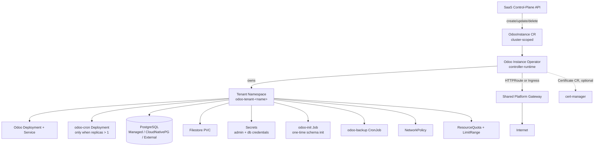
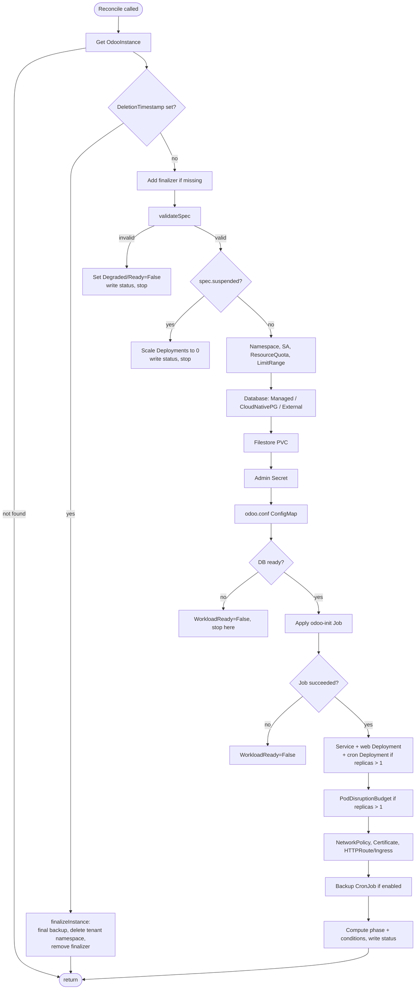
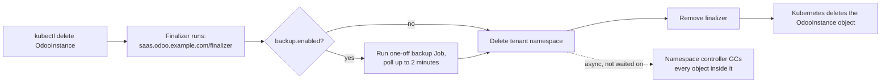
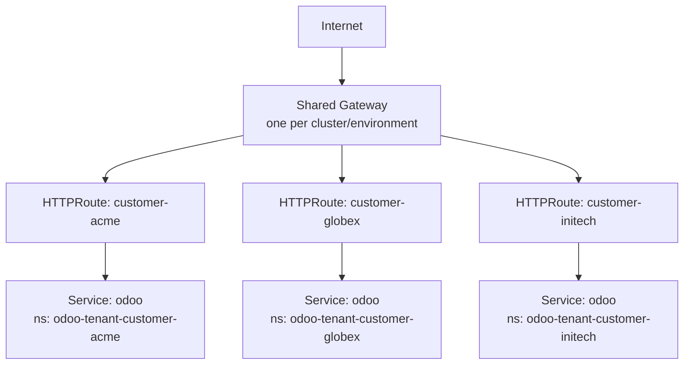
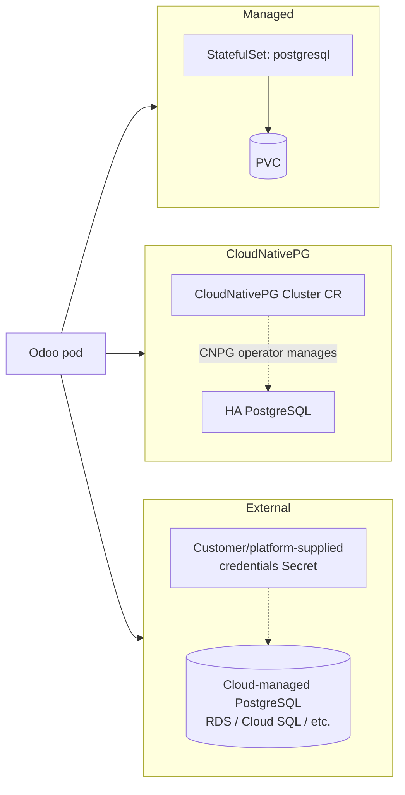
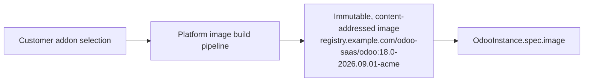
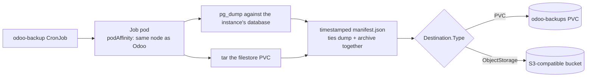
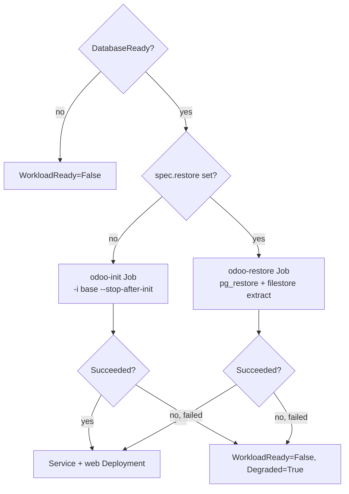

# Architecture

This document explains how the Odoo SaaS platform is put together, the
trade-offs behind its major design decisions, and how a SaaS control-plane
API is expected to integrate with it. Everything here was validated against
a real Kubernetes cluster (microk8s, with the Gateway API and Traefik
installed) while building this repository, not just compiled — see
"Known Limitations" for the handful of things that could not be exercised
that way.

## 1. High-level architecture



The SaaS API's entire contract with Kubernetes is the `OdooInstance`
custom resource: it creates, reads, updates, and deletes that one object
and never touches a Deployment, Service, PVC, Secret, or Job directly. The
operator (a single `controller-runtime` controller) is the only thing that
talks to those child resource kinds.

## 2. Component responsibilities

| Component | Responsibility |
|---|---|
| `api/v1alpha1` | The `OdooInstance` CRD type: spec, status, validation/defaulting markers. The only schema either side of the SaaS-API/Kubernetes boundary needs to agree on. |
| `internal/resources` | Pure functions: `(instance) -> desired Kubernetes object`. No API calls. Fully unit-testable without a cluster. |
| `internal/controller` | The reconciliation loop: fetches live state, calls `internal/resources` builders, Server-Side-Applies the result, computes status/conditions. |
| `cmd/main.go` | Wires the reconciler into a `controller-runtime` manager: scheme registration, leader election, metrics/health servers, CLI flags for platform-wide configuration. |
| `charts/odoo-operator` | Installs the operator itself (CRD + RBAC + Deployment). This is what a platform operator runs once per cluster. |
| `charts/odoo-instance` | Optional: a GitOps wrapper that renders one `OdooInstance` per Helm release, for platforms that provision tenants through Argo CD/Flux instead of direct API calls. |

## 3. CRD design

```yaml
apiVersion: saas.odoo.example.com/v1alpha1
kind: OdooInstance
metadata:
  name: customer-acme        # cluster-scoped; see "Multi-Tenancy Model"
spec:
  version: "18.0"
  image: {repository, tag, pullPolicy, pullSecretRefs}
  domain: {hostname, tls: {enabled, secretName, issuerRef}}
  database: {mode: Managed|CloudNativePG|External, version, storage, credentialsSecretRef}
  storage: {filestore: {size, storageClassName, accessMode}}
  resources: {requests, limits}                # required
  addons: [{name}]                              # informational only
  workers: {count, maxCronThreads}
  replicas: 1
  autoscaling: {enabled}                         # reserved, not yet implemented
  backup: {enabled, schedule, retention, destination}
  restore: {source: {type: PVC|ObjectStorage, bucket, prefix, objectStorageSecretRef, backupId}}  # optional, immutable once set — see §16
  networking: {networkPolicy: {enabled}, routeAnnotations}
  tenancy: {namespaceOverride, resourceQuota}
  suspended: false
status:
  observedGeneration: 1
  phase: Pending|Provisioning|Ready|Updating|Degraded|Failed|Suspended|Deleting
  conditions: [{type, status, reason, message, lastTransitionTime, observedGeneration}]
  url: https://customer-acme.example.com
  tenantNamespace: odoo-tenant-customer-acme
  adminCredentialsSecretName: odoo-admin-credentials
  databaseCredentialsSecretName: odoo-database-credentials
  observedImage: registry.example.com/odoo-saas/odoo:18.0-abc123
  replicas: 1
  readyReplicas: 1
  lastBackupTime: "2026-09-13T02:00:00Z"
  lastBackupStatus: Succeeded
```

Full field documentation lives as Go doc comments on
`api/v1alpha1/odooinstance_types.go` — that file, not this one, is the
schema's source of truth (`make manifests` regenerates the CRD YAML from
it). A few design choices are worth calling out here:

- **`resources` is required, with no defaults.** Every other Kubernetes
  primitive it's built from (workers, replicas, PVC sizes) is meaningless
  without knowing the compute budget; forcing this up front makes tenant
  capacity planning explicit instead of accidental.
- **`addons` is metadata, not a runtime instruction.** See §9.
- **`image.tag` rejects mutable tags** (`latest`, `main`, ...) unless the
  operator is started with `--allow-mutable-tags` (development only). See
  §9 again.
- **Conditional requirements (e.g. `backup.schedule` only when
  `backup.enabled`) are validated in Go (`internal/controller/validate.go`),
  not as CRD-schema `required`.** An earlier draft got this wrong — marking
  `schedule` unconditionally `required` in the CRD schema, which rejected
  every instance that didn't set backups at all. Live-testing against a
  real apiserver caught it in minutes; a schema-only review would not have.

### A CRD defaulting gotcha (worth understanding before extending this API)

A few fields — `domain.tls.enabled`, `networking.networkPolicy.enabled`,
`workers.count`, `workers.maxCronThreads` — have a **non-zero** CRD
default (`true`, `true`, `2`, `1`) and are deliberately declared **without**
`json:"...,omitempty"`. This looks backwards at first glance, so here is
the reasoning, discovered by hitting the bug live:

Go's `encoding/json` only honors `omitempty` by checking each field's *Go
zero value* (`false`, `0`, `""`, nil) — it has no idea a CRD default
exists. If `TLSSpec.Enabled` had `omitempty`, then any Go client (this
controller included) that fetches the object, leaves `Enabled: false` in
memory, and re-marshals the whole struct for an `Update()` would silently
**drop** the `enabled` key from the request (because `false` looks
"empty" to the JSON encoder) — and the API server would then reapply the
schema's `default: true`, flipping a customer's explicit "no TLS" back to
"TLS on" without anyone changing the spec. This was reproduced exactly
that way against a live cluster in the course of building this operator.

Two independent fixes are in place:

1. These specific fields no longer use `omitempty`, so their Go zero value
   is always sent explicitly and can never be re-defaulted away.
2. The controller's own only spec-mutating write (adding/removing the
   finalizer) now uses `client.Patch` with `client.MergeFrom`, not a
   whole-object `Update` — so it only ever sends a diff of
   `metadata.finalizers`, never re-serializing `spec` at all.

The corollary: **a Go client constructing a partial `OdooInstanceSpec`
literal gets the Go zero value for these fields, not the CRD default**,
unless it says otherwise. `api/v1alpha1/defaults.go` provides
`DefaultOdooInstanceSpec()` for exactly this reason — start from it and
override what you need, rather than relying on server-side defaulting from
a typed Go struct.

## 4. Reconciliation flow



Every step is a pure "compute desired object, Server-Side Apply it"
operation (see §11, Idempotency) — there is no `if firstTime { create }`
branch anywhere in this codebase.

### Why the web Deployment is gated behind a database-init Job

Odoo will not serve a single HTTP request against a database with no
schema — every request 500s with `KeyError: 'ir.http'` because the model
registry has nothing to load. This is not a hypothetical: it is exactly
what happened the first time this operator's web Deployment was created
immediately after the database became reachable, before anything had run
`odoo -i base` against it. The fix is `resources.OdooInitJob` /
`internal/controller/init_job.go`: a one-time Job that runs
`-i base --stop-after-init`, and the web (and cron) Deployment is only
created once that Job's `status.succeeded > 0`. The controller still
treats this as idempotent reconciliation — "does this Job exist and has it
succeeded" — even though the action the Job performs is genuinely a
one-time, non-repeatable operation from Odoo's own point of view.

### A gating deadlock this design avoids

An earlier version of this gate also required `StorageReady` (the
filestore PVC bound) before creating the init Job. On a cluster whose
default StorageClass uses `VolumeBindingMode: WaitForFirstConsumer` — which
is most production StorageClasses (EBS/PD/local-path, and this platform's
own microk8s-hostpath test cluster) — a PVC never binds until some pod
actually references it and gets scheduled. Requiring "bound" before
creating the first pod that would trigger binding is a deadlock, and it
reproduced immediately in testing. The fix: the init Job (and every other
consumer of the PVC) only requires the PVC to **exist**, never to already
be **Bound**.

## 5. Resource ownership and deletion

Every namespaced child resource carries `ownerReferences` pointing at the
`OdooInstance` (a valid reference even though the owner is cluster-scoped —
Kubernetes permits a namespaced object to be owned by a cluster-scoped
one, just not the reverse). This is belt-and-suspenders observability and
GC, not the primary deletion mechanism:



**Known, deliberate limitation:** deleting the tenant namespace also
deletes its PVCs — filestore, database, and any locally-stored backups.
There is no "delete everything except these volumes" primitive once the
owning namespace is torn down. Real data retention after tenant deletion
therefore depends on the final backup landing in `spec.backup.destination`
**before** the namespace is deleted, which is exactly why an
`ObjectStorage` destination (outside the tenant namespace) is the
recommended choice for any tenant whose data must survive deletion — a PVC
destination does not survive it.

## 6. Multi-tenancy model (Question 3)

**Decision: `OdooInstance` is cluster-scoped, and the controller derives
and creates a dedicated `odoo-tenant-<name>` namespace per instance.**

Alternatives considered:

| Option | Trade-off |
|---|---|
| Namespaced CRD, SaaS API pre-creates namespaces | Two API calls instead of one; the SaaS API would need its own namespace-lifecycle logic (naming, RBAC, quotas) that duplicates what the operator already needs to do internally for tenancy anyway. |
| Namespaced CRD, shared namespace across tenants | Rejected outright: no NetworkPolicy/RBAC/ResourceQuota isolation boundary between customers sharing one namespace; a compromised or noisy-neighbor tenant directly affects others. |
| **Cluster-scoped CRD, operator owns namespace-per-tenant (chosen)** | One API call provisions full isolation. Cost: the operator needs `namespaces` create/delete RBAC (cluster-scoped), which is a larger permission than a namespaced-CRD design would need — mitigated by the rest of its RBAC being otherwise minimal (see §10). |

Namespace-per-tenant gives:

- **NetworkPolicy** boundaries (§7) that are impossible to bypass by
  mis-scoping a selector, since there is nothing else in the namespace to
  select.
- **ResourceQuota/LimitRange** (`internal/resources/tenancy.go`) capping
  total consumption independent of what a single `OdooInstance` requests.
- A **deletion story** that is one namespace delete, not N individually
  targeted resource deletes.
- Trivial **naming**: `odoo-tenant-<instance name>` (overridable via
  `spec.tenancy.namespaceOverride` for migration/rename scenarios).

## 7. Networking (Question 4)

**Decision: Gateway API HTTPRoute is the default and preferred routing
mechanism; classic Ingress is a fully-supported fallback, selected by an
operator-wide flag (`--networking-provider`), never per-tenant.**



Why Gateway API over one Ingress/LoadBalancer per tenant: a dedicated cloud
LoadBalancer per customer does not scale economically or operationally
past a handful of tenants (see §12, scaling to 1000+). A shared Gateway
with one `HTTPRoute` per tenant scales the same way whether there are 10 or
10,000 tenants, and is the direction the Kubernetes networking ecosystem is
standardizing on. `OdooInstance.spec.domain.hostname` is the only thing a
tenant ever specifies; the routing resource kind and shared Gateway
identity are platform (operator flag) configuration, not tenant
configuration — this is also why they are `--gateway-namespace`/
`--gateway-name`/`--networking-provider` flags on `cmd/main.go`, not CRD
fields.

This was validated against Traefik's Gateway API implementation on a real
cluster: `HTTPRoute` objects were created, accepted (`status.parents[].
conditions[type=Accepted]=True`), and served real traffic.

## 8. Database architecture (Question 1)

**Decision: `spec.database.mode` is `Managed` (default), `CloudNativePG`,
or `External` — a pluggable strategy, never PostgreSQL running inside the
Odoo pod itself.**



| Mode | What the operator creates | When to use |
|---|---|---|
| `Managed` (default) | A single-replica `StatefulSet` + PVC + Service, all owned by this `OdooInstance` | Zero-dependency default; good for early-stage adoption and dev/test. No HA, no PITR. |
| `CloudNativePG` | A CloudNativePG `Cluster` custom resource (via the dynamic/unstructured client — no Go dependency on CloudNativePG's module) | Production: real HA, automated failover, PITR backups, all behind the exact same `OdooInstance` API. Requires the CloudNativePG operator installed. |
| `External` | Nothing — the operator only reads a pre-existing credentials `Secret` | Cloud-managed PostgreSQL (RDS, Cloud SQL, Azure Database), or any database the platform manages outside Kubernetes entirely. |

All three modes converge on the same internal contract: a Secret named
`odoo-database-credentials` (or the customer-provided name in External
mode) with keys `host`, `port`, `dbname`, `username`, `password`. Odoo's
own config renderer (the init container that produces `odoo.conf`, see
§13) never needs to know which mode produced that Secret. Switching a
tenant from `Managed` to `CloudNativePG` in production is therefore a
migration project (dump/restore, then flip `spec.database.mode`), not an
API redesign.

Why not "one shared PostgreSQL cluster, one database per tenant"? It was
considered and rejected for the default path: a single shared cluster
becomes a blast-radius and noisy-neighbor risk across all tenants, and
"database per tenant in a shared cluster" still needs per-tenant
credential/network isolation work that a dedicated
(`Managed`/`CloudNativePG`) instance gets for free from namespace
isolation. It remains a valid pattern for extreme-scale, low-resource
tenants (see §12) and could be added later as a fourth `DatabaseMode`
without touching the rest of this API.

## 9. Addons & image strategy

Addons are **build-time, not run-time**. `spec.addons` is a declarative
record of what a tenant's image is expected to contain — used for
validation/status/tracking — never an instruction to download or install
anything inside a running pod.



This is a security and reproducibility decision: arbitrary addon
downloads at pod startup are a supply-chain risk (unreviewed code
executing with the tenant's database credentials) and break rollback
(what exactly was running at 3am when it broke?). `spec.image.tag`
additionally rejects common mutable tags (`latest`, `main`, `edge`, ...)
by default (`--allow-mutable-tags=false`), pushing the platform towards
one immutable image per (version, addon set) combination.

## 10. Security review

- **RBAC**: the operator's `ClusterRole` (generated from
  `+kubebuilder:rbac` markers, `config/rbac/role.yaml`) grants exactly the
  resource kinds this codebase creates — no wildcards, no `cluster-admin`,
  no access to Secrets/ConfigMaps/etc. outside the kinds it manages. It was
  run as its own `ServiceAccount` (not an admin kubeconfig) against a real
  cluster and successfully reconciled an instance to `Ready` with zero
  `forbidden` errors.
- **Pod Security**: every container (Odoo, the config-render init
  container, PostgreSQL, the backup tool) runs `runAsNonRoot: true`,
  `allowPrivilegeEscalation: false`, all Linux capabilities dropped, and
  (Odoo/Postgres) `readOnlyRootFilesystem: true` with every writable path
  as an explicit volume. The tenant namespace itself carries
  `pod-security.kubernetes.io/enforce: restricted`.
- **A concrete gotcha found and fixed**: the official Odoo image declares
  `USER odoo` (a *name*, not a numeric UID) in its Dockerfile. Kubernetes
  cannot statically verify a named user is non-root, so `runAsNonRoot:
  true` without an explicit numeric `runAsUser` made the container fail to
  start outright (`container has runAsNonRoot and image has non-numeric
  user (odoo), cannot verify user is non-root"`), reproduced on a live
  cluster. The fix is `runAsUser: 100` / `runAsGroup: 101`, verified by
  running `id` inside the actual image
  (`internal/resources/deployment.go`, `odooImageUID`/`odooImageGID`).
  This value is specific to the official Odoo image; a custom platform
  image build must either keep this account or the constant must be
  updated to match — Kubernetes has no way to discover it automatically
  when the Dockerfile's `USER` is a name.
- **Secrets**: the admin master password and database password are
  generated once (`internal/resources/secrets.go`, alphanumeric-only,
  cryptographically random) and never regenerated on subsequent reconciles
  (`existingOrNewPassword` always prefers the live Secret's value). They
  reach Odoo only via an init container's `secretKeyRef` environment
  variables, used purely to `sed`-substitute them into a config file the
  *main* Odoo container never receives as environment variables — reducing
  where the plaintext is exposed inside the pod. Neither password is ever
  written into `status`, events, or logs.
- **NetworkPolicy**: default-deny with narrow allow rules — ingress only
  from the shared Gateway's pods (by namespace + label selector) plus
  intra-namespace traffic; egress limited to DNS, the tenant's own
  database port, and HTTPS (443) for outbound integrations. No rule ever
  references another tenant's namespace, so cross-tenant traffic is
  impossible by construction, not by policy discipline.
- **Supply chain**: see §9 (immutable image tags, no runtime addon
  downloads).

## 11. Idempotency and reliability

Every child resource is (re)computed from `OdooInstance.spec` on every
reconcile and applied via **Server-Side Apply**
(`internal/controller/apply.go`, `client.Apply` + `client.ForceOwnership`)
rather than a hand-rolled "Get, diff, maybe Update." This is what makes
running the reconcile loop once or a thousand times converge to the same
state: a deleted or drifted child resource is simply recreated/corrected
on the very next pass, with no `if firstTime` branch anywhere. Controller
restarts are safe for the same reason — all state needed to resume
reconciliation is `OdooInstance.spec` plus whatever is already live in the
cluster, never in-memory controller state.

Failure handling follows the same principle: a reconcile error
(`handleReconcileError`) sets `Degraded=True` with a specific reason,
records a warning Event, and returns the error so controller-runtime's
exponential-backoff requeue takes over — it is never retried in a tight
loop. An unfixable spec problem (`validateSpec`) is surfaced as
`Degraded`/`Ready=False` with a reason a human or the SaaS API can act on,
and is **not** retried at all until the spec changes (there is nothing a
retry could fix). The `Degraded` condition itself resets to `False` at the
start of every reconcile pass rather than staying "stuck" from an
earlier, now-resolved problem — an early version of this controller got
that wrong (a transient `InitJobFailed` stayed `Degraded=True` forever
even after a later pass fixed it), caught during testing.

## 12. Scaling from 0 to 1000+ tenants

Nothing in the controller's design is O(tenants) in a way that requires
redesign as tenant count grows:

- **Namespace-per-tenant** scales linearly and each tenant's resources are
  independent — there is no shared mutable state between reconciles of
  different instances.
- **The shared Gateway** (§7) means routing is O(1) load balancers
  regardless of tenant count, only O(tenants) `HTTPRoute` objects, which
  Gateway API implementations are built to handle at scale.
- **The controller itself** is a standard `controller-runtime` manager
  with a work queue and configurable concurrency; horizontal scaling of
  the *reconciler* (not the tenant workloads) is the standard
  leader-election-plus-sharding path controller-runtime already supports,
  not something this codebase needs to invent.
- **What genuinely needs revisiting well before 1000+ tenants**: the
  `Managed` database mode's one-StatefulSet-per-tenant default is
  reasonable at dozens-to-low-hundreds of tenants but becomes a lot of
  small PostgreSQL instances to operate; that is precisely why
  `DatabaseMode` is pluggable (§8) — migrating the fleet to
  `CloudNativePG` (or, per §8, a future "shared cluster, database per
  tenant" mode for very small/inactive tenants) is a data migration, not
  an API change.

## 13. The Odoo worker model (workers vs. replicas vs. cron)

These are three different axes and conflating them causes real bugs (see
§4's init-Job discussion for one that was caught live):

- **`spec.workers.count`** is Odoo's own internal process model
  (`--workers`): a small number of OS processes inside *one pod* handling
  concurrent HTTP requests, plus one dedicated gevent process for
  longpolling (live chat/bus) when `count > 0`. This is not a Kubernetes
  concept at all.
- **`spec.replicas`** is the number of *pods*. Default and recommended: 1.
  Odoo's cron workers and the default `ReadWriteOnce` filestore both push
  towards a single-writer topology; see §14 for the filestore trade-off in
  full. `replicas > 1` requires `storage.filestore.accessMode:
  ReadWriteMany` and is rejected otherwise (`validateSpec`).
- **`spec.workers.maxCronThreads`** must run in exactly one place, not once
  per pod replica, or scheduled jobs execute more than once. At
  `replicas: 1` the single web Deployment simply runs cron itself. At
  `replicas > 1` the controller creates a **second, dedicated,
  single-replica `odoo-cron` Deployment** (`--workers=0`,
  `--max-cron-threads=<configured>`) and forces `--max-cron-threads=0` on
  every web replica — this is why `resources.NeedsCronDeployment` exists
  and why it is *not* implemented as "pin cron to Deployment replica
  ordinal 0," which Deployments (unlike StatefulSets) do not guarantee in
  the first place.

`spec.autoscaling` is deliberately inert in this API version: naive HPA on
CPU/memory is unsafe with singleton cron workers and (by default) an RWO
filestore backing every replica. The field is validated
(`validateSpec` rejects `enabled: true` outright) but not acted on, so it
reserves the API surface for a future, autoscaling-safe topology (e.g. a
split stateless web tier with cron pinned elsewhere) without a breaking
change later.

## 14. Filestore architecture

`storage.filestore.accessMode` defaults to `ReadWriteOnce`. Odoo
coordinates filestore writes only with simple file locking — there is no
cache-invalidation protocol between processes on different nodes. RWO is
safe for the default, recommended `replicas: 1` topology. `ReadWriteMany`
is accepted (and required — see §13) for `replicas > 1`, but is only
actually safe when the StorageClass provides a genuinely shared,
POSIX-consistent filesystem (NFS, CephFS, EFS) — the controller cannot
verify that property of a StorageClass itself, so choosing RWX is a
platform-operator responsibility, not something this API can fully
validate away.

A related, load-bearing consequence discovered while building the backup
CronJob (`internal/resources/backup.go`): with the RWO default, a backup
Job that also mounts the filestore PVC must be scheduled onto the *same
node* as the Odoo pod currently holding it — hence the backup Job's
`podAffinity` to the Odoo pod's own labels. This constraint disappears
once a tenant's filestore is RWX or (a natural extension this API already
has room for via `BackupDestinationSpec`) moved to object storage.

## 15. Backups



Database and filestore backups are coordinated into one run so a restore
never mixes a database snapshot with a mismatched filestore snapshot.
`BackupDestinationType` (`PVC` or `ObjectStorage`) and `Retention` are the
extensibility points; the CronJob's actual image
(`resources.DefaultBackupToolImage`, overridable via
`--backup-tool-image`) is a platform-operated build, analogous to the Odoo
image itself, expected to bundle `pg_dump`, `tar`, and (for
`ObjectStorage`) an object-storage CLI. This MVP mechanism is intentionally
not a substitute for a real backup product at scale — see "Known
Limitations."

## 16. Restoring an existing backup

**Decision: `spec.restore`, when set at creation time, replaces the
ordinary `odoo-init` Job with a one-time restore Job as the thing gating
the web Deployment — the exact same gating point, not a second
orchestration path.**



This is the customer-facing onboarding choice described in the platform
requirements — "new database" vs. "restore an existing backup" — modeled
as one additional, optional, immutable CRD field rather than a second
provisioning architecture. The SaaS API never needs to know a restore Job,
`pg_restore`, or any other Kubernetes implementation detail exists; it
only ever sets `spec.restore` at instance-creation time and reads
`status.phase`/`status.conditions` back, exactly like every other part of
this API (see §20).

### API shape

```yaml
spec:
  restore:
    source:
      type: ObjectStorage      # or "PVC" — the same BackupDestinationSpec
                                # abstraction spec.backup.destination uses
      bucket: customer-migrations
      prefix: customer-migrated
      objectStorageSecretRef:
        name: customer-migrated-restore-creds
      backupId: "2026-09-01T02-00-00Z"   # optional; omit for "most recent"
```

`spec.restore.source` deliberately embeds `BackupDestinationSpec` — the
exact type `spec.backup.destination` already uses — instead of a parallel
storage abstraction: a restore source is, structurally, exactly where a
backup destination already points, and reusing it means an ObjectStorage
backup written by *this platform's own* backup CronJob (§15) for one
tenant can be restored into a brand-new instance (e.g. re-onboarding a
churned-then-returning customer, or standing up a staging copy) with zero
new plumbing. `backupId` is the one addition: it selects which
timestamped backup at that destination to restore (matching the
directory name, for a PVC destination, or object-key prefix, for
ObjectStorage, that a backup run's `manifest.json` ties together — see
§15); omitted, it means "the most recent one found."

**Immutable once set.** `OdooInstanceSpec.Restore` carries a CRD
`XValidation` rule (`self == oldSelf`) — the same pattern already used by
`spec.tenancy.namespaceOverride` — so it can only ever be given a value at
`kubectl apply`/create time; any later update that sets, changes, or
clears it is rejected by the API server outright, before the controller
ever sees it. This is deliberately a blunter guarantee than "immutable
only after Ready": it is enforced structurally (spec vs. spec, no status
lookup needed), which is simpler and strictly safer, at the cost that a
typo in `spec.restore` cannot be corrected in place — the fix is to
provision a new OdooInstance. Given a restore is inherently a
once-per-instance onboarding action, this trade-off was chosen
deliberately over a more permissive (and more complex) status-aware
webhook rule.

### Restore Job

`resources.OdooRestoreJob` (`internal/resources/restore.go`) is the direct
inverse of `resources.BackupCronJob` (§15), sharing its credential-wiring
convention: the same `DatabaseSecretName` Secret (`DB_HOST`/`DB_PORT`/
`DB_USER`/`DB_NAME`/`PGPASSWORD`) and, for an ObjectStorage source, the
same `OBJECT_STORAGE_ENDPOINT`/`OBJECT_STORAGE_ACCESS_KEY`/
`OBJECT_STORAGE_SECRET_KEY` Secret-sourced env vars `BackupCronJob` uses.
It mounts the instance's filestore PVC read-write at `/var/lib/odoo` (the
same path `odoo-init` and the web Deployment use) so the restored
attachments land exactly where Odoo expects them, and runs
`/usr/local/bin/run-restore.sh` in a platform-built tool image
(`--restore-tool-image`, default `resources.DefaultRestoreToolImage`) —
by convention the same image that provides `BackupCronJob`'s
`run-backup.sh`, though it is an independently overridable default in
case a platform ever wants to version backup and restore tooling
separately. That script (like `run-backup.sh`, not part of this Go
codebase) is expected to, in order, and log each step distinctly:

1. Locate the backup identified by `SOURCE_TYPE`/`SOURCE_BUCKET`/
   `SOURCE_PREFIX`/`BACKUP_ID` (or the most recent one, via its
   `manifest.json`, when `BACKUP_ID` is empty).
2. Download the database dump and run `pg_restore` against the
   instance's own database (already created empty by `DatabaseModeManaged`/
   `CloudNativePG`'s bootstrap — see §8 — by the time this Job runs, since
   it only runs once `DatabaseReady` is true).
3. Download and extract the filestore archive under
   `${ODOO_DATA_DIR}/filestore/${DB_NAME}` (the env vars this Job sets
   communicate Odoo's own filestore layout convention to the tool image,
   rather than hardcoding it twice).
4. Exit non-zero on any step's failure, identifying which step failed in
   its own log line, so `internal/controller/restore.go` can distinguish
   "still running" from "failed" the same way it already does for the
   backup CronJob.

### Gating and idempotency

`internal/controller/restore.go`'s `reconcileRestore` is structurally
identical to `reconcileInitJob` (§4) — both produce the same
`schemaGateResult{succeeded, failed, reason, message}` shape, and
`Reconcile` picks whichever one applies (`spec.restore != nil` ->
restore; otherwise -> the ordinary init Job) as the single thing gating
`reconcileWorkload`. This reuses the existing initialization gate rather
than adding a second one: a restore-configured instance's web Deployment
is created if and only if the restore Job's `status.succeeded > 0`,
exactly as a fresh instance's web Deployment is created if and only if
`odoo-init`'s `status.succeeded > 0`. The two are mutually exclusive per
instance: `odoo-init` is never created at all when `spec.restore` is set.

Idempotency follows directly from the same properties `odoo-init` already
relies on: the controller never recreates the restore Job once it has
observed `Status.Succeeded > 0` (there is no `if firstTime` branch —
Server-Side-Applying the same desired Job object on an already-succeeded
Job is a no-op, since a Job's pod template is immutable after creation),
and `spec.restore`'s CRD-level immutability means the desired Job's shape
itself can never change out from under a running or completed restore
either. Reconciling once or a thousand times after success therefore
never re-runs `pg_restore` — verified directly by
`TestReconcile_RestoreIdempotent_MultipleReconcilesDoNotRerunRestore`
(`internal/controller/odooinstance_controller_test.go`), which asserts
the Job's UID/ResourceVersion are unchanged across four extra
reconciles.

### Status and failure handling

A restore-configured instance carries an additional
`RestoreReady` condition (`ConditionRestoreReady`) — set to `False` with
reason `RestorePending`/`RestoreRunning` while the Job is not yet
observed/still running, `True` with reason `RestoreSucceeded` once it
succeeds, or `False` with reason `RestoreFailed` (also setting
`Degraded=True`, mirroring `InitJobFailed`'s handling) if the Job
exhausts `BackoffLimit`. This condition is never set at all for an
ordinary (non-restore) instance — matching the platform's existing
"only surface a condition for a dependency that actually applies"
convention (a fresh instance was never given its own analogous
`InitJobReady` condition either; `odoo-init`'s outcome is folded directly
into `WorkloadReady`'s reason instead — restoring gets its own condition
because, unlike `odoo-init`, it is conditionally applicable per instance
and worth surfacing distinctly to the SaaS API/customer as "Restoring
your data" rather than generic "Provisioning").

A failed restore Job never creates the web Deployment (§4/§19's
"never serve `KeyError: 'ir.http'`" guarantee extends unchanged to
"never serve a half-restored database" either) and is **not** retried
automatically beyond the Job's own `BackoffLimit` (`2`, the same value
`BackupCronJob` uses) — matching the platform-wide principle of never
looping destructive-adjacent operations forever. Recovery is manual:
inspect the restore Job's pod logs (which identify the failed step, per
the log convention above) and either fix the underlying problem (bad
credentials, missing backup) and provision a **new** OdooInstance with a
corrected `spec.restore` (the old one is immutable, per above), or fall
back to a fresh empty database by provisioning without `spec.restore` at
all.

### Customer-facing flow

The SaaS frontend/API only ever needs `status.phase` and the
`RestoreReady`/`WorkloadReady`/`Ready` conditions to render the onboarding
flow described in the platform requirements, without exposing any
Kubernetes detail:

| Customer sees | Backed by |
|---|---|
| "Restoring database…" | `RestoreReady=False`, reason `RestorePending`/`RestoreRunning` |
| "Restoring filestore…" | Same condition — the restore Job's own pod logs (not exposed via the CRD) carry the finer-grained step; the CRD only distinguishes Job-level pending/running/succeeded/failed, matching how Odoo's own application logs are deliberately never proxied into controller-level status (§17) |
| "Starting Odoo…" | `RestoreReady=True`, `WorkloadReady=False` (web Deployment created, pods not yet ready) |
| "Ready" | `status.phase == "Ready"` |
| Restore failed | `status.phase == "Degraded"`, `RestoreReady=False`/reason `RestoreFailed` |

### Known limitations

- **`Source.Type: PVC` requires the source PVC to already exist and be
  pre-populated** by the platform's onboarding/migration pipeline
  *before* this OdooInstance is created — this builder, unlike
  `BackupCronJob`, does not create that PVC itself. It reuses the exact
  PVC name `BackupPVCName` already defines for this tenant
  (`odoo-backups`), so a platform that also enables `spec.backup` with a
  PVC destination on a restored instance will have both mechanisms share
  that one volume. This mirrors External database mode's existing
  precondition that its credentials Secret must pre-exist (§8) — an
  ObjectStorage source avoids this ordering problem entirely and is the
  recommended choice for onboarding a customer's backup from outside the
  platform.
- **CloudNativePG mode restores as the `odoo` application user, not a
  superuser** (`enableSuperuserAccess: false`, §8) — a dump that includes
  `CREATE EXTENSION` statements for extensions not already present in the
  target database image may fail to restore under CloudNativePG even
  though the identical restore succeeds under `DatabaseModeManaged`
  (whose `odoo` user is the actual PostgreSQL superuser created by the
  official `postgres` image's `initdb`). Pre-baking required extensions
  into the CloudNativePG cluster image, or restoring into `Managed` mode
  first and migrating afterwards (§8), are the two current workarounds.
- **The restore tool image's `run-restore.sh` is not part of this Go
  codebase**, exactly like `run-backup.sh` is not (§15) — this section
  documents the contract (env vars, expected steps, log convention) the
  operator relies on, not an implementation.
- **No dry-run / pre-flight validation of the backup artifacts.** A
  malformed dump or a `BackupID` that does not exist at the destination
  surfaces only as a failed restore Job, the same way a bad `External`
  database connection surfaces only once the Odoo pod's startup probe
  fails (§8, §21).

## 17. Observability

The controller exposes Prometheus metrics on the manager's existing
metrics endpoint (`internal/controller/metrics.go`):
`odoo_instance_reconciles_total`, `odoo_instance_reconcile_errors_total{reason}`,
`odoo_instance_reconcile_duration_seconds`, and
`odoo_instances_by_phase{phase}` (recomputed periodically by
`PhaseMetricsCollector`, since a per-phase gauge needs the whole
population, not just the instance currently reconciling). `charts/
odoo-operator` can optionally create a Prometheus Operator `ServiceMonitor`
(`values.yaml`: `metrics.serviceMonitor.enabled`). Odoo application logs
stay on the Odoo pod's own stdout — deliberately never proxied into the
controller's logs.

## 18. Upgrade strategy

Changing `spec.image.tag` (or `spec.version`) triggers a standard
`RollingUpdate` of the Odoo Deployment (`MaxUnavailable: 0, MaxSurge: 1` —
safe even at `replicas: 1`, since the new pod comes up before the old one
terminates). This is a **routine image/config update**, not a database
migration: the controller never runs Odoo's own module-upgrade machinery
(`-u <module>`) automatically. Odoo module upgrades and destructive schema
changes are a customer/platform-operator decision requiring explicit
action (a follow-up Job, run the same way the init Job is, is the natural
extension point — not implemented in this API version, to avoid
automating something genuinely dangerous to automate). This mirrors the
platform requirement to never perform a destructive migration just because
an image tag changed.

## 19. Failure recovery

| Failure | Surfaced as | Recovery |
|---|---|---|
| Invalid/unfixable spec | `Degraded=True`, specific `reason` (e.g. `UnsupportedVersion`) | Fix the spec; the controller does not retry a spec problem indefinitely. |
| Database StatefulSet/Cluster never becomes ready | `DatabaseReady=False`, requeued | Self-heals once the dependency (storage provisioner, CloudNativePG operator) recovers. |
| `odoo-init` Job exhausts its retries | `WorkloadReady=False`, `Degraded=True`, reason `InitJobFailed`, Warning Event | Investigate the Job's pod logs; the controller does not recreate a Job that already exists purely to "try again." |
| Restore Job (spec.restore set) exhausts its retries | `RestoreReady=False`/`WorkloadReady=False`, `Degraded=True`, reason `RestoreFailed`, Warning Event | Investigate the restore Job's pod logs (§16); `spec.restore` is immutable, so provision a new OdooInstance with a corrected source rather than editing this one. |
| Child resource deleted out-of-band | Self-heals on the next reconcile (SSA recreates it) | Automatic — this is exactly what idempotent reconciliation (§11) is for. |
| Controller restarts mid-provisioning | No special-cased recovery needed | All state is `spec` + live cluster state; the next reconcile simply continues. |
| Deletion finalizer's final backup fails | Warning Event, deletion proceeds anyway (not blocked forever) | Deliberate: never block a customer's delete request indefinitely on a backup failure; the operator prioritizes not stalling destructive-adjacent operations forever. |

## 20. SaaS API integration contract

```python
# Illustrative pseudocode — see any Kubernetes client library for your
# language of choice. Every operation is standard CRUD/watch against one
# CRD; nothing here is bespoke to this platform.

def create_instance(customer):
    spec = default_odoo_instance_spec()          # mirror api/v1alpha1/defaults.go
    spec.version = customer.odoo_version
    spec.image.tag = build_pipeline.resolve_tag(customer)
    spec.domain.hostname = f"{customer.slug}.saas.example.com"
    spec.resources = customer.plan.resources
    k8s.create("OdooInstance", name=customer.slug, spec=spec)

def create_instance_from_backup(customer, backup_reference):
    # Same call as create_instance, plus one optional, immutable field —
    # see §16. The customer/frontend never sees "restore Job", "pg_restore",
    # or any other Kubernetes/PostgreSQL detail; get_status/watch_until_ready
    # below work completely unchanged for a restored instance.
    spec = default_odoo_instance_spec()
    spec.version = customer.odoo_version
    spec.image.tag = build_pipeline.resolve_tag(customer)
    spec.domain.hostname = f"{customer.slug}.saas.example.com"
    spec.resources = customer.plan.resources
    spec.restore = {"source": backup_reference}   # e.g. {"type": "ObjectStorage",
                                                    #       "bucket": ..., "prefix": ...,
                                                    #       "objectStorageSecretRef": {"name": ...}}
    k8s.create("OdooInstance", name=customer.slug, spec=spec)

def get_status(customer):
    obj = k8s.get("OdooInstance", name=customer.slug)
    return {
        "phase": obj.status.phase,             # Provisioning | Ready | Degraded | ...
        "url": obj.status.url,
        "ready": any(c.type == "Ready" and c.status == "True"
                     for c in obj.status.conditions),
    }

def watch_until_ready(customer, timeout):
    for event in k8s.watch("OdooInstance", name=customer.slug, timeout=timeout):
        if event.object.status.phase == "Ready":
            return event.object.status.url
        if event.object.status.phase in ("Failed", "Degraded"):
            raise ProvisioningError(event.object.status.conditions)

def update_plan(customer, new_plan):
    k8s.patch("OdooInstance", name=customer.slug,
              spec={"resources": new_plan.resources, "workers": new_plan.workers})

def suspend(customer):
    k8s.patch("OdooInstance", name=customer.slug, spec={"suspended": True})

def delete_instance(customer):
    k8s.delete("OdooInstance", name=customer.slug)
    # The finalizer runs a final backup (if enabled) before the tenant
    # namespace and everything in it is removed.
```

The API never needs to know a Deployment, StatefulSet, PVC, Secret, or Job
exists — `status.phase`, `status.conditions`, and `status.url` are the
entire read-side contract.

## 21. Known limitations / next steps

Being explicit about what this MVP does *not* do, rather than
overstating it:

- **Restore-from-backup (`spec.restore`) has its own known limitations** —
  see §16's own "Known limitations" subsection (PVC-source pre-staging,
  CloudNativePG superuser/extensions, no pre-flight artifact validation).
- **`spec.autoscaling` is validated but not implemented** — see §13.
  Needs an autoscaling-safe topology (split web tier) first.
- **Module upgrades / schema migrations on image change are not
  automated** — see §18. Deliberate, not an oversight.
- **The `Managed` database mode has no HA/PITR** — that is what
  `CloudNativePG` mode is for (§8); `Managed` is meant as a zero-dependency
  on-ramp, not the production end-state for a paying tenant.
- **The MVP backup CronJob is a real, coordinated mechanism (§15), not a
  toy script — but it is also not a substitute for Velero or a managed
  database backup product at real production scale.** The abstraction
  (`BackupDestinationType`, pluggable image) is designed so it can be
  replaced or supplemented without an API change.
- **External mode does not verify actual database connectivity** — the
  controller deliberately carries no PostgreSQL driver dependency (least
  privilege for a cluster-privileged controller); a bad external DB
  surfaces once the Odoo pod itself fails its startup probe.
- **PVC-backed backup retention does not survive tenant deletion** — see
  §5; only an `ObjectStorage` destination does.
- **Not exercised against a real cert-manager or CloudNativePG
  installation in this pass** (the test cluster had neither installed);
  the integration is written against their well-documented CRD shapes via
  the dynamic client and reconciles conditions/status the same way the
  Gateway API integration does, but has not been live-verified the way
  Gateway API, Managed PostgreSQL, and Ingress were.
